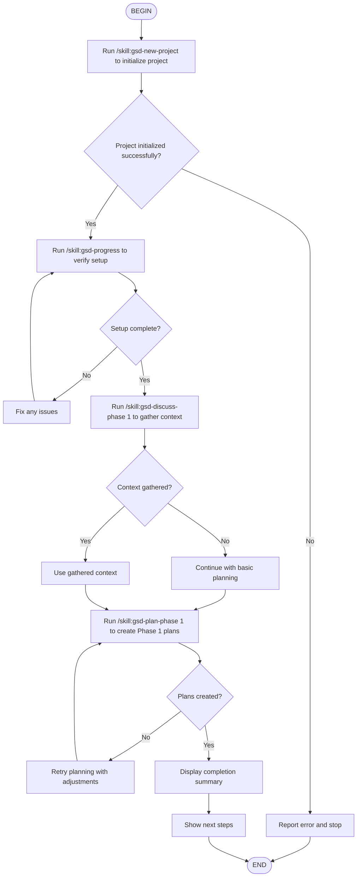

# GSD Bootstrap Flow

This flow skill automates the complete GSD setup for a new project:
1. Project initialization with deep questioning
2. Requirements documentation
3. Roadmap creation with phases
4. Phase 1 planning with research

## Execution Notes

**Phase 1 (Initialization)**:
- Ask user what they want to build
- Gather deep context through questioning
- Create all planning documents
- Initialize .planning/ structure

**Phase 2 (Discussion)**:
- Analyze Phase 1 goals
- Identify gray areas
- Get user decisions
- Create CONTEXT.md

**Phase 3 (Planning)**:
- Research if enabled
- Create NN-01-PLAN.md
- Verify with plan-checker if enabled
- Present results

**Completion**: Project is ready for execution with `/skill:gsd-execute-phase 1`
