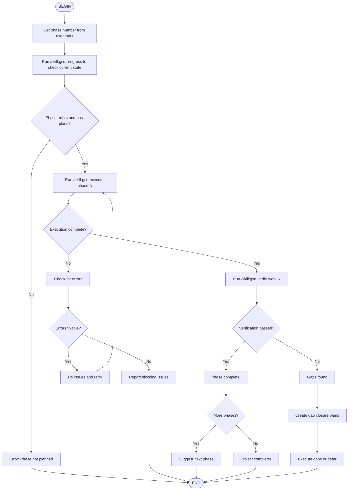

# GSD Phase Execution Flow

This flow skill automates phase execution:
1. Validate phase exists and has plans
2. Execute plans in parallel by wave
3. Verify phase completion
4. Handle gaps if found

## Execution Notes

**Pre-execution**:
- Verify phase has PLAN.md files
- Check current project state
- Confirm user wants to proceed

**Execution**:
- Spawn gsd-executor subagents in parallel
- Coordinate by wave (Wave 1, then Wave 2, etc.)
- Collect results and summaries
- Handle any checkpoints

**Verification**:
- Spawn gsd-verifier to check completion
- Compare against phase goals
- Identify any gaps
- Create fix plans if needed

**Next Steps**:
- If passed → Suggest next phase or complete
- If gaps → Offer to fix or defer to next phase
