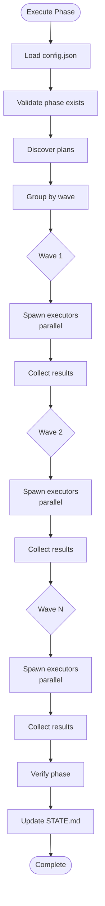

# GSD Execute Phase

Execute all plans in a phase using wave-based parallel execution with Task subagents.

## Arguments

```
/skill:gsd-execute-phase <phase-number> [--gaps-only]
```

- `phase-number` - Phase to execute (e.g., "04", "4", or "04-new-project")
- `--gaps-only` - Execute only gap closure plans (optional)

## Prerequisites

- [ ] `.planning/PROJECT.md` exists (project initialized)
- [ ] Phase exists in `.planning/phases/`
- [ ] Phase has PLAN.md files to execute
- [ ] `config.json` has valid settings

## Process

### Step 1: Resolve Model Profile

Read `.planning/config.json` for model settings:

```bash
cat .planning/config.json 2>/dev/null | python3 -c "
import sys, json
try:
    d = json.load(sys.stdin)
    profile = d.get('model_profile', 'balanced')
    print(f'MODEL_PROFILE={profile}')
except:
    print('MODEL_PROFILE=balanced')
"
```

**Model lookup table:**

| Agent | quality | balanced | budget |
|-------|---------|----------|--------|
| executor | claude-sonnet-4 | kimi-k2.5 | kimi-k2.5 |
| verifier | claude-sonnet-4 | kimi-k2.5 | kimi-k2.5 |

Default: balanced → kimi-k2.5

### Step 2: Validate Phase Exists

**Resolve phase argument:**

```bash
PHASE_ARG="$1"
PADDED_PHASE=$(printf "%02d" "$PHASE_ARG" 2>/dev/null || echo "$PHASE_ARG")

# Find matching phase directory
PHASE_DIR=$(find .planning/phases -maxdepth 1 -type d \( -name "${PADDED_PHASE}-*" -o -name "${PHASE_ARG}-*" \) 2>/dev/null | head -1)

if [ -z "$PHASE_DIR" ]; then
    echo "ERROR: Phase $PHASE_ARG not found in .planning/phases/"
    exit 1
fi

PHASE_NAME=$(basename "$PHASE_DIR")
echo "Found phase: $PHASE_NAME"
```

**Count plans:**

```bash
PLAN_COUNT=$(ls -1 "$PHASE_DIR"/*-PLAN.md 2>/dev/null | wc -l)

if [ "$PLAN_COUNT" -eq 0 ]; then
    echo "ERROR: No PLAN.md files found in $PHASE_DIR"
    exit 1
fi

echo "Found $PLAN_COUNT plans to execute"
```

### Step 3: Discover Plans

**List all PLAN.md files:**

```bash
ls -1 "$PHASE_DIR"/*-PLAN.md 2>/dev/null | sort
```

**Check completion status:**

For each plan, check if corresponding SUMMARY.md exists:

```bash
for plan in "$PHASE_DIR"/*-PLAN.md; do
    plan_name=$(basename "$plan" .md)
    summary="$PHASE_DIR/${plan_name/-PLAN/-SUMMARY}.md"
    
    if [ -f "$summary" ]; then
        echo "✓ $plan_name (complete)"
    else
        echo "⏳ $plan_name (pending)"
        PENDING_PLANS+=("$plan")
    fi
done
```

**Filter for `--gaps-only`:**

If flag is set, read frontmatter and filter to only plans with `gap_closure: true`:

```bash
# Extract gap_closure from frontmatter
if grep -q "^gap_closure: true" "$plan" 2>/dev/null; then
    GAP_PLANS+=("$plan")
fi
```

### Step 4: Group by Wave

**Read wave from frontmatter:**

For each pending plan, extract wave number (default: 1):

```bash
for plan in "${PENDING_PLANS[@]}"; do
    wave=$(grep -E "^wave:\s*" "$plan" 2>/dev/null | head -1 | sed 's/wave:\s*//' || echo "1")
    echo "Plan $(basename $plan): wave $wave"
done
```

**Report wave structure:**

```
Wave 1: 3 plans
Wave 2: 2 plans  
Wave 3: 1 plan
```

### Step 5: Execute Waves

For each wave in order:

**5a. Prepare parallel execution:**

Read plan contents and project context:

```bash
# Read STATE.md for context
STATE_CONTENT=$(cat .planning/STATE.md 2>/dev/null || echo "")

# Read each plan in wave
for plan in "${WAVE_PLANS[@]}"; do
    plan_content=$(cat "$plan")
    plan_path=$(realpath "$plan")
    echo "Preparing: $(basename $plan)"
done
```

**5b. Spawn executor subagents in parallel:**

Use Task tool to spawn a `gsd-executor` subagent for each plan:

```python
Task(
    description=f"Execute plan: {plan_name}",
    subagent_name="gsd-executor",
    prompt=f"""
Execute this GSD plan atomically.

## Plan Location
{plan_path}

## Plan Content
{plan_content}

## Project Context
{STATE_CONTENT}

## Your Task
1. Read the PLAN.md file above
2. Execute ALL tasks in order
3. Create SUMMARY.md in the same directory
4. Commit each task individually with format: "type(XX-YY): description"
5. Return completion report

## Deviation Rules (apply automatically)
- Rule 1: Auto-fix bugs (wrong behavior, errors, security issues)
- Rule 2: Auto-add missing critical functionality (validation, auth, error handling)
- Rule 3: Auto-fix blocking issues (missing deps, broken imports, config errors)
- Rule 4: STOP and checkpoint for architectural changes (new DB tables, framework switches)

## Commit Rules
- Stage files individually (never git add .)
- Commit after each task completes
- Use format: type(XX-YY): description
- Types: feat, fix, test, refactor, perf, docs, style, chore

## Checkpoint Protocol
If you hit a checkpoint (human-verify, decision, human-action):
1. STOP immediately
2. Return structured checkpoint message with:
   - Completed tasks table (with commits)
   - Current task details
   - What user needs to do

## Output Format
Return exactly:
```
## PLAN COMPLETE

**Plan:** XX-YY
**Tasks:** N/N complete
**SUMMARY:** path/to/SUMMARY.md

**Commits:**
- hash: message
- hash: message

**Deviations:** (list any auto-fixes)
**Checkpoints:** (list if any)
```
"""
)
```

**All Task calls run in parallel.** Wait for all to complete.

**5c. Collect results:**

After all subagents complete:
- Check for SUMMARY.md files created
- Note any failures
- Collect completion reports

**5d. Commit wave (optional):**

```bash
# Check if planning docs should be committed
COMMIT_PLANNING=$(cat .planning/config.json 2>/dev/null | python3 -c "
import sys, json
try:
    d = json.load(sys.stdin)
    print('true' if d.get('planning', {}).get('commit_docs', True) else 'false')
except:
    print('true')
")

if [ "$COMMIT_PLANNING" = "true" ]; then
    git add "$PHASE_DIR"/*-SUMMARY.md 2>/dev/null
    git commit -m "docs(${PHASE_NAME}): complete wave ${WAVE_NUM}

Executed ${#WAVE_PLANS[@]} plans in wave ${WAVE_NUM}.

Co-Authored-By: Kimi k2.5 <noreply@moonshot.cn>"
fi
```

**5e. Proceed to next wave:**

Repeat until all waves complete.

### Step 6: Aggregate Results

**Collect all summaries:**

```bash
SUMMARY_COUNT=$(ls -1 "$PHASE_DIR"/*-SUMMARY.md 2>/dev/null | wc -l)
echo "Completed: $SUMMARY_COUNT/$PLAN_COUNT plans"
```

**Report phase status:**

```
╔══════════════════════════════════════════════════════════════╗
║              PHASE EXECUTION COMPLETE                        ║
╠══════════════════════════════════════════════════════════════╣
║                                                              ║
║  Phase: XX-name                                              ║
║  Plans executed: N                                           ║
║  Waves: N                                                    ║
║  Status: complete/partial                                    ║
║                                                              ║
╚══════════════════════════════════════════════════════════════╝
```

### Step 7: Commit Orchestrator Corrections

Check for any changes made by orchestrator:

```bash
if [ -n "$(git status --porcelain 2>/dev/null)" ]; then
    # Stage each modified file individually
    git status --porcelain | grep '^ M' | cut -c4- | while read file; do
        git add "$file"
    done
    
    git commit -m "fix(${PHASE_NAME}): orchestrator corrections"
fi
```

### Step 8: Verify Phase Goal

**Check verifier setting:**

```bash
VERIFIER_ENABLED=$(cat .planning/config.json 2>/dev/null | python3 -c "
import sys, json
try:
    d = json.load(sys.stdin)
    print('true' if d.get('workflow', {}).get('verifier', True) else 'false')
except:
    print('true')
")
```

**If verifier enabled:**

Spawn verification subagent:

```python
Task(
    description=f"Verify phase {PHASE_NAME}",
    subagent_name="gsd-verifier",
    prompt=f"""
Verify phase completion against phase goals.

## Phase
{PHASE_DIR}

## Verification Tasks
1. Read phase goal from ROADMAP.md
2. Read all SUMMARY.md files
3. Check must_haves against actual codebase
4. Create VERIFICATION.md report
5. Assign status: passed, gaps_found, or human_needed

## Output
Return verification status and report location.
"""
)
```

**Route based on status:**

| Status | Action |
|--------|--------|
| `passed` | Continue to Step 9 |
| `gaps_found` | Offer `/skill:gsd-plan-phase {phase} --gaps` |
| `human_needed` | Present checklist, get approval |

### Step 9: Update Roadmap and State

**Update STATE.md:**

```markdown
## Current Position

Phase: [current phase]
Status: Phase executed, awaiting verification
Last activity: [date] - Executed phase [phase]
```

**Update ROADMAP.md:**

Mark phase as executed:

```markdown
## Phase XX: Name

Status: Executed ✓
```

**Update REQUIREMENTS.md:**

Mark phase requirements as Complete:

1. Read ROADMAP.md for this phase's Requirements line
2. Find each REQ-ID in REQUIREMENTS.md
3. Change Status from "Pending" to "Complete"
4. Write updated file

### Step 10: Offer Next Steps

**Route A: Phase verified, more phases remain**

```
━━━━━━━━━━━━━━━━━━━━━━━━━━━━━━━━━━━━━━━━━━━━━━━━━━━━━
 GSD ► PHASE {Z} COMPLETE ✓
━━━━━━━━━━━━━━━━━━━━━━━━━━━━━━━━━━━━━━━━━━━━━━━━━━━━━

Phase {Z}: {Name}

{Y} plans executed
Goal verified ✓

───────────────────────────────────────────────────────────────

## ▶ Next Up

**Phase {Z+1}: {Name}** — {Goal}

/skill:gsd-plan-phase {Z+1}

───────────────────────────────────────────────────────────────
```

**Route B: Gaps found**

```
━━━━━━━━━━━━━━━━━━━━━━━━━━━━━━━━━━━━━━━━━━━━━━━━━━━━━
 GSD ► PHASE {Z} GAPS FOUND ⚠
━━━━━━━━━━━━━━━━━━━━━━━━━━━━━━━━━━━━━━━━━━━━━━━━━━━━━

Score: {N}/{M} must-haves verified

### What's Missing

[List gaps from VERIFICATION.md]

───────────────────────────────────────────────────────────────

## ▶ Next Up

/skill:gsd-plan-phase {Z} --gaps

───────────────────────────────────────────────────────────────
```

**Route C: Last phase complete**

```
━━━━━━━━━━━━━━━━━━━━━━━━━━━━━━━━━━━━━━━━━━━━━━━━━━━━━
 GSD ► MILESTONE COMPLETE 🎉
━━━━━━━━━━━━━━━━━━━━━━━━━━━━━━━━━━━━━━━━━━━━━━━━━━━━━

All phases executed and verified!

───────────────────────────────────────────────────────────────

## ▶ Next Up

/skill:gsd-verify-work --final

───────────────────────────────────────────────────────────────
```

## Wave Execution Pattern



## Deviation Rules

Executors apply these rules automatically:

| Rule | Trigger | Action | User Permission |
|------|---------|--------|-----------------|
| **Rule 1** | Code doesn't work (bugs, errors) | Fix immediately, track | Not needed |
| **Rule 2** | Missing critical functionality (validation, auth) | Add immediately, track | Not needed |
| **Rule 3** | Blocking issues (deps, imports) | Fix to unblock, track | Not needed |
| **Rule 4** | Architectural changes (new tables, frameworks) | STOP, checkpoint | Required |

## Commit Rules

**Per-Task Commits:**

```bash
# After each task completes
git add [specific files]
git commit -m "type(XX-YY): task description"
```

**Plan Metadata Commit:**

```bash
# After plan completes
git add XX-YY-SUMMARY.md
git commit -m "docs(XX-YY): complete [plan-name] plan"
```

**Phase Completion Commit:**

```bash
# After phase completes
git add .planning/ROADMAP.md .planning/STATE.md
git commit -m "docs(XX): complete [phase-name] phase"
```

**NEVER use:**
- `git add .`
- `git add -A`
- `git add src/` (broad directories)

## Error Handling

### Plan Execution Fails

- Log failure
- Continue with other plans in wave
- Report failed plans at end

### All Plans in Wave Fail

- Stop execution
- Report critical error
- Suggest checking plan validity

### Checkpoint Reached

Executor returns structured checkpoint:

```markdown
## CHECKPOINT REACHED

**Type:** human-verify | decision | human-action
**Plan:** XX-YY
**Progress:** N/M tasks complete

### Completed Tasks

| Task | Name | Commit | Files |
|------|------|--------|-------|
| 1 | Task name | abc123 | file1, file2 |

### Current Task

**Task N:** Task name
**Status:** blocked | awaiting verification
**Blocked by:** Specific blocker

### Checkpoint Details

[What user needs to do]

### Awaiting

Type "approved" or describe issues.
```

## Outputs

### Files Created/Modified

- `$PHASE_DIR/*-SUMMARY.md` - Plan execution summaries
- `$PHASE_DIR/*-VERIFICATION.md` - Phase verification report (if enabled)
- `.planning/STATE.md` - Updated with current position
- `.planning/ROADMAP.md` - Phase status updated
- `.planning/REQUIREMENTS.md` - Requirements marked complete

### Git Commits

- One commit per task (atomic)
- One commit per plan metadata
- One commit per wave (optional)
- One commit for phase completion

## Next Commands

| Situation | Command |
|-----------|---------|
| Verify completed phase | `/skill:gsd-verify-work <phase>` |
| Plan next phase | `/skill:gsd-plan-phase <phase>` |
| Check overall progress | `/skill:gsd-progress` |
| Execute with gaps | `/skill:gsd-execute-phase <phase> --gaps-only` |

## Success Criteria

- [ ] All incomplete plans in phase executed
- [ ] Each plan has SUMMARY.md
- [ ] All waves completed in order
- [ ] Phase goal verified (or verification scheduled)
- [ ] STATE.md updated with completion
- [ ] ROADMAP.md updated
- [ ] REQUIREMENTS.md updated
- [ ] User informed of next steps
