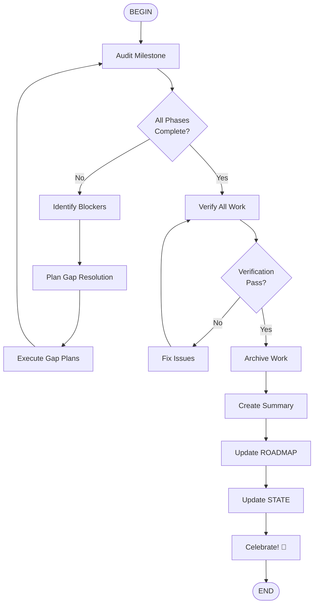

# Complete Milestone Workflow

## Workflow Steps

1. **Audit Milestone** - Run comprehensive audit
2. **Check Completion** - Verify all phases done
3. **Fix Blockers** - Address any issues
4. **Verify Work** - Final verification
5. **Archive** - Move completed work
6. **Document** - Create completion summary
7. **Celebrate** - Acknowledge achievement!
