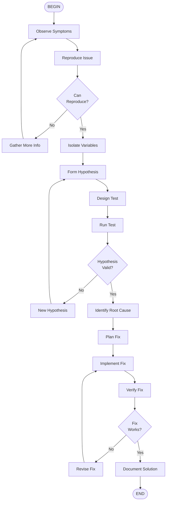

# Diagnose Issues Workflow

## Scientific Method Applied

1. **Observation** - What do we see?
2. **Hypothesis** - Why is it happening?
3. **Experiment** - How can we test?
4. **Analysis** - What did we learn?
5. **Conclusion** - What's the fix?
