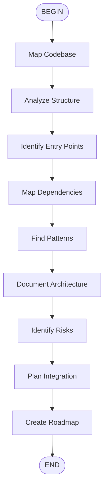

# Discovery Phase Workflow

## Discovery Outputs

1. **CODEBASE-MAP.md** - Structure and organization
2. **ARCHITECTURE.md** - System design
3. **DEPENDENCIES.md** - Internal and external deps
4. **RISKS.md** - Technical risks and mitigation
5. **INTEGRATION-PLAN.md** - How to add new work

## Key Questions

- What's the tech stack?
- Where does data flow?
- What are the conventions?
- What's the test coverage?
- Where are the risks?
