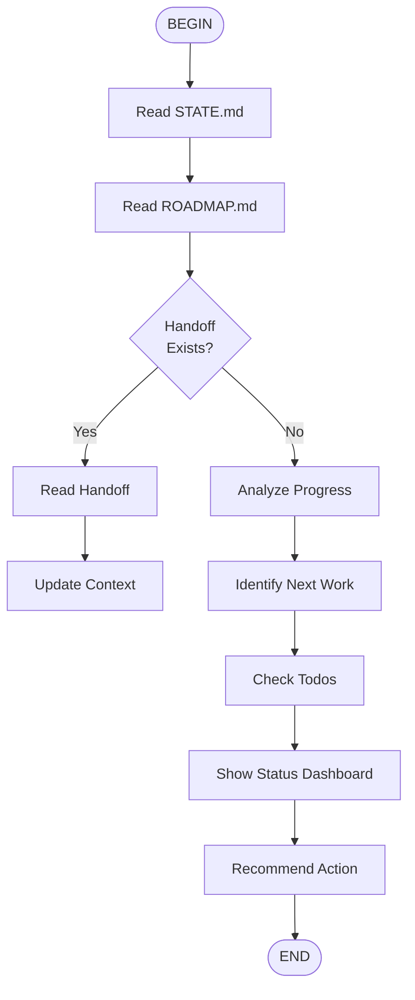

# Resume Project Workflow

## Resume Actions

Based on state, recommend:
- **Continue Phase** - If phase in progress
- **Start Next Phase** - If current complete
- **Verify Work** - If verification pending
- **Plan Phase** - If no plan exists
- **Debug Issues** - If blocked

## Status Dashboard

Shows:
- Current phase and % complete
- Open todos
- Recent commits
- Blockers (if any)
- Next recommended action
