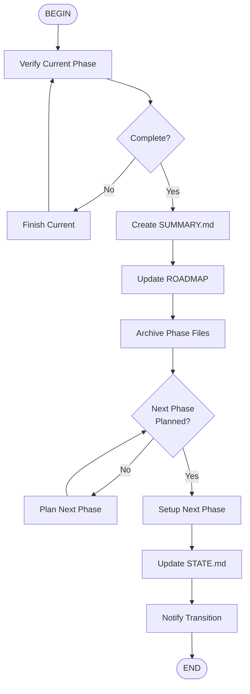

# Phase Transition Workflow

## Transition Checklist

- [ ] Current phase verified complete
- [ ] SUMMARY.md created
- [ ] ROADMAP.md updated
- [ ] Phase files archived
- [ ] Next phase planned
- [ ] STATE.md updated
- [ ] Context switched

## Clean Transition

Leave previous phase:
- All files committed
- Tests passing
- Documentation complete

Enter next phase:
- Plan reviewed
- Todos created
- Context loaded
