# Verify Phase Workflow

```mermaid
flowchart TD
    BEGIN([BEGIN]) --> LOAD_PLAN[Load PLAN.md]
    LOAD_PLAN --> CHECK_MUST_HAVES{Must-Haves<br/>Complete?}
    CHECK_MUST_HAVES -->|No| LIST_INCOMPLETE[List Incomplete]
    LIST_INCOMPLETE --> PLAN_COMPLETION[Plan Completion]
    PLAN_COMPLETION --> END
    CHECK_MUST_HAVES -->|Yes| RUN_TESTS[Run Tests]
    RUN_TESTS --> TESTS_PASS{Tests<br/>Pass?}
    TESTS_PASS -->|No| FIX_TESTS[Fix Failures]
    FIX_TESTS --> RUN_TESTS
    TESTS_PASS -->|Yes| CHECK_REQUIREMENTS[Check Requirements]
    CHECK_REQUIREMENTS --> REQ_MET{Requirements<br/>Met?}
    REQ_MET -->|No| ADDRESS_GAPS[Address Gaps]
    ADDRESS_GAPS --> CHECK_REQUIREMENTS
    REQ_MET -->|Yes| VERIFY_QUALITY[Verify Quality]
    VERIFY_QUALITY --> QUALITY_OK{Quality<br/>OK?}
    QUALITY_OK -->|No| IMPROVE[Improve Quality]
    IMPROVE --> VERIFY_QUALITY
    QUALITY_OK -->|Yes| CREATE_SUMMARY[Create SUMMARY.md]
    CREATE_SUMMARY --> UPDATE_STATE[Update STATE.md]
    UPDATE_STATE --> PHASE_PASS[✅ Phase Pass]
    PHASE_PASS --> END([END])
```

## Verification Criteria

1. **Must-Haves** - All critical items complete
2. **Tests** - All tests passing
3. **Requirements** - Matches REQUIREMENTS.md
4. **Quality** - Code quality standards met
5. **Documentation** - Complete and accurate
